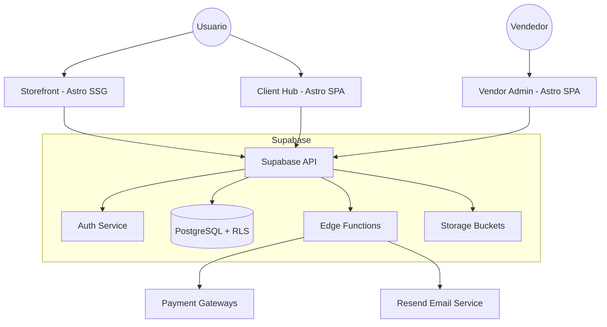

# Micro-Store Arch - Documento de Arquitectura

## Visión General

Micro-Store Arch es un ecosistema de e-commerce Jamstack de alto rendimiento compuesto por 3 aplicaciones distribuidas y una infraestructura serverless.

## Diagrama de Arquitectura

## Decisiones Técnicas Clave

1. **Jamstack puro:** Despliegue en el borde (Cloudflare Pages) sin servidores fijos.
2. **Astro para todo el frontend:** Enfoque en islas de interactividad y rendimiento.
3. **Supabase Edge Functions:** Lógica de negocio distribuida y escalable.
4. **Seguridad Multi-capa:** RLS en base de datos, MFA en admin, y encriptación pgsodium.
5. **Costo Operativo Mínimo:** Optimizado para capas gratuitas (Cloudflare/Supabase).

## Estructura del Proyecto

- `apps/*`: Aplicaciones frontend.
- `packages/*`: Lógica compartida y configuraciones.
- `supabase/*`: Infraestructura de base de datos y backend.
- `scripts/*`: Automatización de ops y seguridad.
